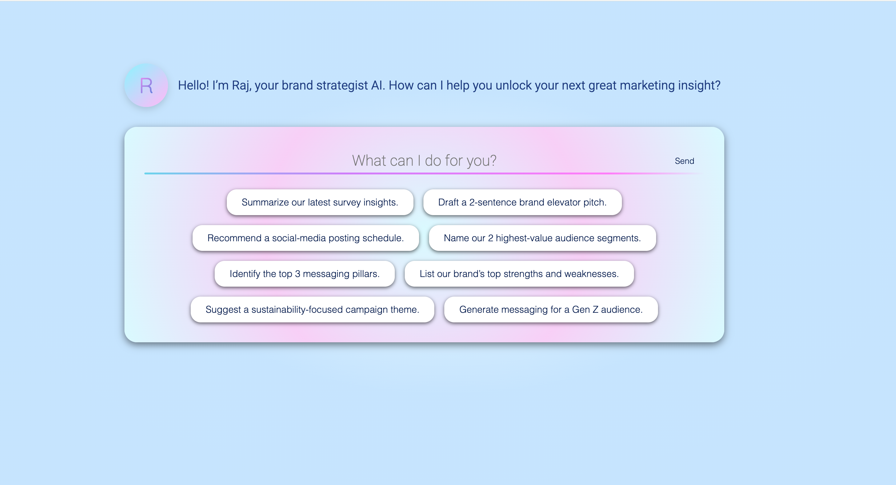

# RajChat

This repository contains a full‑stack AI chat application called Raj Chat, built to demonstrate proficiency in TypeScript/Angular (frontend), Python/FastAPI (backend), and AI integration via OpenAI. 

**Live Demo:** https://raj-chat-jqtz.onrender.com

---
## Table of Contents

- [Project Overview](#project-overview)
- [Tech Stack](#tech-stack)  
- [Demo](#demo)  
- [Architecture](#architecture)
- [Getting Started](#getting-started)  
  - [Prerequisites](#prerequisites)  
  - [Local Installation](#local-installation)  
- [Deployment](#deployment)  

---
## Project Overview

Raj Chat allows users to ask marketing and brand‑strategy questions through a sleek Angular interface. User inputs are sent to a FastAPI backend, which forwards the query (plus system context) to OpenAI’s GPT‑3.5‑turbo model. Responses stream back and display as chat bubbles. Features:

Real-time chat with a FastAPI-powered AI backend.

Interactive Chat UI with avatars and auto‑scrolling message pane.

Question Presets on the welcome page and a custom input field.

OpenAI Integration with environment‑configured API key.

Persistent Chat History stored in SQLite (via SQLModel).

---
## Tech Stack

- **Frontend:** Angular 16, TypeScript, SCSS, HTML  
- **Backend:** FastAPI, Python 3.11, Uvicorn, SQLModel (SQLite)
- **AI:** openai Python client (GPT‑3.5‑turbo)
- **Version Control:** Git, GitHub
- **Environment Management:** python‑dotenv
- **Deployment:** Render (Static Site + Web Service)  


---
## Demo



Visit the live app here:  
👉 https://raj-chat-jqtz.onrender.com

---
## Architecture

- Frontend runs at http://localhost:4200

- Backend runs at http://localhost:8000

- SQLite database persists chat messages

---
## Getting Started

### Prerequisites

- Node.js & npm
- Python 3.10+
- Git

### Local Installation

1. **Clone the repo**

```bash
git clone https://github.com/kalyanipnblm/raj-chat.git
cd raj-chat
```

2. **Backend setup**

```bash
cd backend
python -m venv .venv
source .venv/bin/activate   
pip install -r requirements.txt
uvicorn main:app --reload --port 8000
```

2. **Frontend setup**

In a separate terminal:

```bash
cd raj-chat
npm ci
ng serve
```
3. **Environment Variables**
Create a .env file in the raj-backend/ directory:
```bash
OPENAI_API_KEY=sk-...
```

## Deployment

### On Render 

1. **Static Site (UI)**

- Build command: 
```bash
npm ci && ng build --configuration production
```
- Publish directory: 
```bash
dist/raj-chat/browser
```

2. **Web Service (API)**

- Build command: 
```bash
pip install -r requirements.txt
```
- Start command: 
```bash
uvicorn main:app --host 0.0.0.0 --port 10000
```

Once both services are up, the app is live at: https://raj-chat-jqtz.onrender.com

